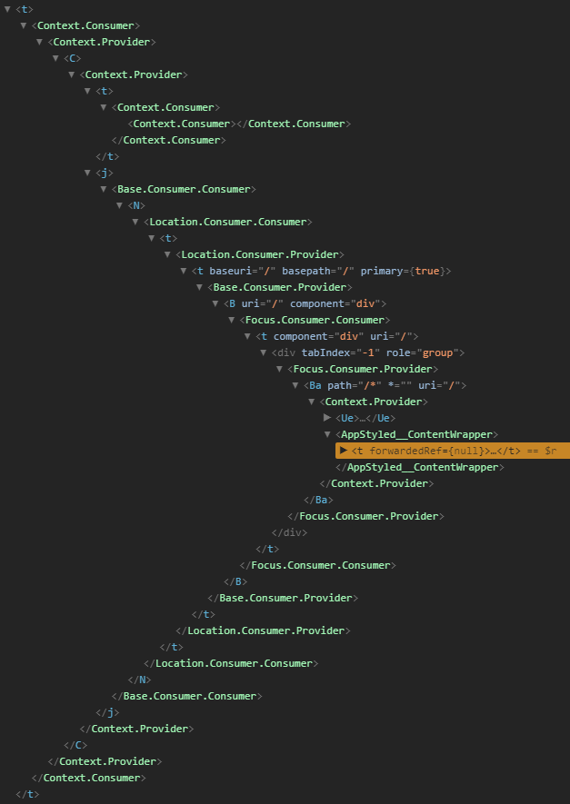

export { future as theme } from 'mdx-deck/themes';
import { Appear } from 'mdx-deck';
import { CodeSurfer } from 'mdx-deck-code-surfer';

## Better Context with React Hooks

<br />
<br />
<br />
<br />

#### Gareth Kloeden

##### March 13, 2019

---

## What is Context?

<ul style={{ textAlign: 'left' }}>
  <Appear>
    <li style={{ margin: '25px 0' }}>Pass data through the component tree without prop drilling</li>
    <li style={{ margin: '25px 0' }}>Share values between components without a direct parent - child relationship</li>
    <li style={{ margin: '25px 0' }}>
      API: <strong>Provider</strong> and <strong>Consumer</strong> components
    </li>
    <li style={{ margin: '25px 0' }}>Officially released in February 2018 with React 16.3</li>
  </Appear>
</ul>

---


---


---

## Context API - Creation & Provider

---

<CodeSurfer
  code={require('!raw-loader!./components/Parent.js')}
  lang="javascript"
  showNumbers={true}
  dark={false}
  steps={[
    { range: [1, 4] },
    { lines: [6] },
    { range: [8, 22] },
    { range: [24, 34] },
    { lines: [25] },
    { range: [28, 31] },
  ]}
/>

---

## ChildOne Component

---

<CodeSurfer
  code={require('!raw-loader!./components/ChildOne.js')}
  lang="javascript"
  showNumbers={true}
  dark={false}
  steps={[{ range: [1, 12] }, { lines: [7], notes: 'No props passed to ChildTwo' }]}
/>

---

## ChildTwo Component

---

<CodeSurfer
  code={require('!raw-loader!./components/ChildTwo.js')}
  lang="javascript"
  showNumbers={true}
  dark={false}
  steps={[
    { range: [1, 23] },
    { lines: [3] },
    { range: [7, 18] },
    { range: [8, 17], notes: 'Render prop to pass context Provider value prop' },
  ]}
/>

---

import Parent from './components/Parent';

<Parent />

---

## Sidenote: Context vs Redux

<Appear>
  <h3>Does context replace the need for Redux?</h3>
  <h1>
    <em>MAYBE</em>
  </h1>
  <p>Redux changes the structure of your app, context doesn't really, both increase complexity</p>
  <p>Redux is more than just global store - Flux architecture, immutability, pure functions, etc</p>
  <p>Redux dev tools are really really good; debugging context with React dev tools is a pain</p>
  <p>
    <strong>If you just need to make state easily available, context is a good solution</strong>
  </p>
  <p>Same for MobX, Cerebral, Apollo Link State, etc...</p>
</Appear>

```notes
Nested context gets reeeallly gnarly really quickly
Even worse with hooks right now as the dev tools don't support complex state inspection in hooks
```

---

## Render Props are Awesome

<Appear>
  <h2 className="iWJQFI">And Also Annoying</h2>
</Appear>

---

<CodeSurfer
  code={require('!raw-loader!./components/NestedContext.js')}
  lang="javascript"
  showNumbers={true}
  dark={false}
  steps={[{ range: [1, 5] }, { range: [7, 21] }, { range: [23, 37] }, { range: [39, 53] }, { range: [55, 83] }]}
/>

---

import NestedContext from './components/NestedContext';

<NestedContext />

---



<Appear>
  <h2 className="iWJQFI">This is insane</h2>
</Appear>

---
